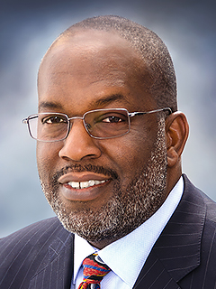

# AI, Healthcare, and the Sopranos test

Presentation at 2017 Southern California Big Data Discovery Summit

---

Alternative title:

# Grey goo or the Self-replicating spacecraft
 
---

>"I don't think any physician today should be practicing without artificial intelligence assisting in their practice. It's just impossible (otherwise) to pick up on patterns and trends and to really monitor care"

Bernard Tyson
CEO, Kaiser Permanente

---

---

# Healthcare Domains
* Preventive care - preventing disease through lifestyle
* Curative care - curing the disease
* Palliative care - reducing the severity of symptoms
* Rehabilitative care
* Drug discovery (clinical trials)
* Security and privacy

---

# Applications
* Surgeries
* Nursing
* Admin
* Fraud
* Drug dosage accuracy and compliance
* Clinical trial participant identifier
* Diagnosis
* Sleeptech
* Personalized health and data
* Behavioral health and patient engagement

---

> "There are many interesting recent development in deep learning. The most important one, in my opinion, is adversarial training (also called GAN for Generative Adversarial Networks). This, and the variations that are now being proposed is the most interesting idea in the last 10 years in ML, in my opinion."

Yann LeCun,
Director of AI research at Facebook

---

# Problems with AI
* Managing AI bias
* Economic impact of automation
* The need to ensure that any intelligent systems we develop share our ethical and moral values

---

# AI Research
* Productivity
* Vision
* Dialog
* Emotion
* Memory
* Intelligence

---

Novartis Uses AWS to Conduct 39 Years of Computational Chemistry In 9 Hours

---

# Drug Discovery

Unsupervised Representation Learning with Deep Convolutional Generative Adversarial Networks

---

# Resources

* DeepMind launches new research team to investigate AI ethics - [Link](https://www.theverge.com/2017/10/4/16417978/deepmind-ai-ethics-society-research-group).

* https://health2con.com/conferences/

* New deep learning research - [Link](http://www.metafilter.com/169839/the-most-important-part-of-learning-is-actually-forgetting).

---

# Media

* Movie - Her (1:45:30).
* Movie - Ghost in the shell.
* Song - Deeper Understanding by Kate Bush - https://www.youtube.com/watch?v=nzqF_gBpS84.
* TV show - Black Mirror. Episodes: White Christmas and Be Right Back.

---
